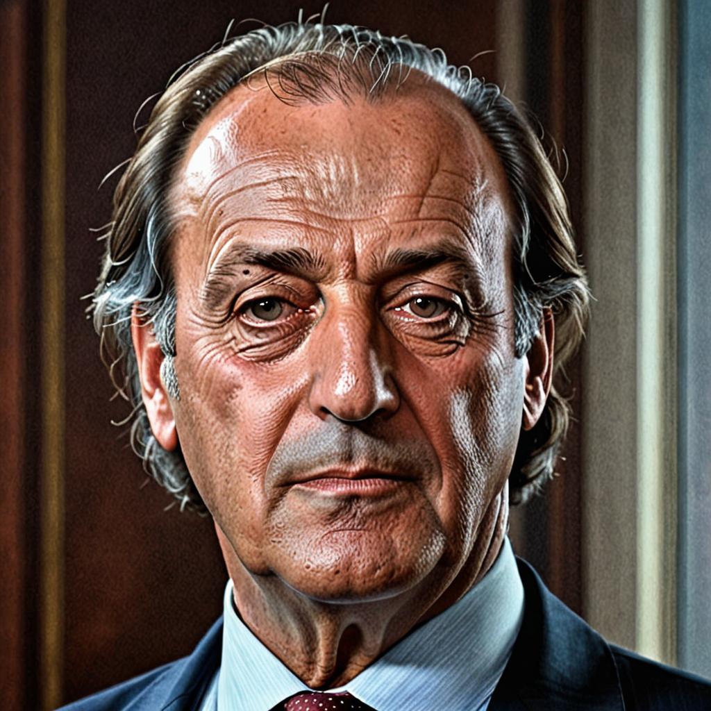
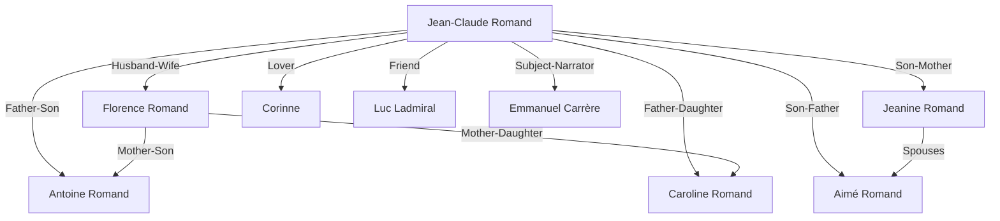

# L'Avversario

“L’Avversario” (The Adversary) by Emmanuel Carrère is a non-fiction novel that explores the life and crimes of Jean-Claude Romand. The story delves into the psychological aspects of Romand’s character, his motivations, and the impact of his actions on those around him. Carrère’s narrative style blends journalism with literary storytelling, offering a profound exploration of truth, deception, and the human condition.

## Main Characters

1. **Jean-Claude Romand**: The central figure of the story, Romand is a French man who pretended to be a successful doctor and researcher at the World Health Organization for 18 years. In reality, he was leading a life of lies and deception, eventually murdering his family when his lies were about to be exposed.

2. **Florence Romand**: Jean-Claude’s wife, who believed in his fabricated life and was one of his victims.

3. **Antoine and Caroline Romand**: The young children of Jean-Claude and Florence Romand, also victims of their father’s actions.

4. **Jeanine and Aimé Romand**: Jean-Claude’s parents, who were also murdered by their son as part of his desperate attempt to cover up his lies.

5. **Corinne**: A close family friend and Jean-Claude’s lover, who plays a significant role in the unraveling of Romand’s deceit.

6. **Luc Ladmiral**: A childhood friend of Jean-Claude who provides insights into his early life and the development of his character.

7. **Emmanuel Carrère**: The author himself becomes a character in the book as he explores and narrates the story of Jean-Claude Romand, providing his own reflections and perspectives on the events.

## Character Portraits

The following prompts were used to create realistic portraits of each character using Midjourney:

1. **Jean-Claude Romand**
   - Prompt:
     ```
     Create a realistic portrait of Jean-Claude Romand. He should be depicted as a distinguished, middle-aged man in professional attire, reflecting his facade as a successful doctor and researcher. His expression should be serious and composed, but with subtle hints of tension or duplicity in his eyes and facial features. Include background elements that hint at his profession, such as medical books or a WHO emblem, but also incorporate shadowy or ambiguous elements to symbolize his deceitful and criminal nature. The overall style should be formal and realistic, capturing the complexity of his character.
     ```
   - Result:
<div align="center">
  
</div>

2. **Florence Romand**
   - Create a realistic portrait of Florence Romand. She should be depicted as a warm and compassionate woman, with features that convey her trust and innocence. Her expression should be gentle and kind, possibly with a hint of melancholy or sadness to reflect the tragedy of her fate. Include background elements that hint at her domestic life, such as a family photo or a cozy home setting. The overall style should be formal and realistic, capturing the essence of her character and the poignancy of her story.
   - Result:


3. **Antoine and Caroline Romand**
   - Create a realistic portrait of Antoine and Caroline Romand. They should be depicted as young, happy children with bright, innocent expressions. Antoine, the older child, could be shown with a protective and caring demeanor towards his younger sister, Caroline. Caroline should be depicted with a joyful and carefree expression. Include background elements that hint at a happy family environment, such as toys, a park, or a home setting. The overall style should be formal and realistic, capturing the innocence and tragedy of their story.
   - Result: [IMAGE]

4. **Jeanine and Aimé Romand**
   - Create a realistic portrait of Jeanine and Aimé Romand. They should be depicted as an elderly couple with warm, kind expressions, reflecting their roles as loving and supportive parents. Jeanine could be shown with a gentle smile, perhaps wearing a simple yet elegant outfit, while Aimé might be depicted with a kind and caring demeanor, possibly with an arm around Jeanine. Include background elements that hint at their family life, such as a cozy home setting or family photographs. The overall style should be formal and realistic, capturing the essence of their characters and the poignancy of their story.
   - Result: [IMAGE]

5. **Corinne**
   - Create a realistic portrait of Corinne. She should be depicted as an elegant and composed woman, with features that convey both affection and the weight of her involvement in the unraveling of Jean-Claude Romand’s deceit. Her expression should reflect a mix of emotions, hinting at her close connection to the Romand family and her pivotal role in the story. Include background elements that suggest her connection to both Jean-Claude and the family, such as a subtle inclusion of personal items or a setting that indicates a shared space. The overall style should be formal and realistic, capturing the complexity and depth of her character.
   - Result: [IMAGE]

6. **Luc Ladmiral**
   - Create a realistic portrait of Luc Ladmiral. He should be depicted as an approachable and friendly individual, with features that convey thoughtfulness and reflection. His expression should show a sense of understanding and insight, hinting at his close bond with Jean-Claude Romand during their childhood. Include background elements that suggest a connection to their shared past, such as childhood memorabilia or a setting that evokes a sense of nostalgia. The overall style should be formal and realistic, capturing the essence of his character and his role in the story.
   - Result: [IMAGE]

7. **Emmanuel Carrère**
   - Create a realistic portrait of Emmanuel Carrère. He should be depicted as a mature, intellectual figure, with features that convey thoughtfulness and introspection. Show him possibly holding a notebook or pen, to emphasize his role as a writer. His expression should reflect deep contemplation and curiosity, indicating his engagement with the story of Jean-Claude Romand. Include background elements that suggest his dual role as author and character, such as a writing desk, books, or a contemplative setting. The overall style should be formal and realistic, capturing the essence of his character and his role in the narrative.
   - Result: [IMAGE]

## Character Relationships

The following outlines the key relationships and their nature, helping to visualize the character connections in the story:

1. **Jean-Claude Romand - Florence Romand**
   - Label: Husband-Wife

2. **Jean-Claude Romand - Antoine Romand**
   - Label: Father-Son

3. **Jean-Claude Romand - Caroline Romand**
   - Label: Father-Daughter

4. **Jean-Claude Romand - Jeanine Romand**
   - Label: Son-Mother

5. **Jean-Claude Romand - Aimé Romand**
   - Label: Son-Father

6. **Jean-Claude Romand - Corinne**
   - Label: Lover

7. **Jean-Claude Romand - Luc Ladmiral**
   - Label: Friend

8. **Jean-Claude Romand - Emmanuel Carrère**
   - Label: Subject-Narrator

9. **Florence Romand - Antoine Romand**
   - Label: Mother-Son

10. **Florence Romand - Caroline Romand**
    - Label: Mother-Daughter

11. **Jeanine Romand - Aimé Romand**
    - Label: Spouses

## Lucidchart Code

The code that can be imported to Lucidchart to draw this relationship map is as follows:



## Combining the Results

The results combining the created chart in Lucidchart and the generated images by Midjourney, after a bit of summarization and adjustment, are as follows:
[IMAGE]

Feel free to use this character map to gain a deeper understanding of the relationships and dynamics in "L'Avversario" by Emmanuel Carrère.
